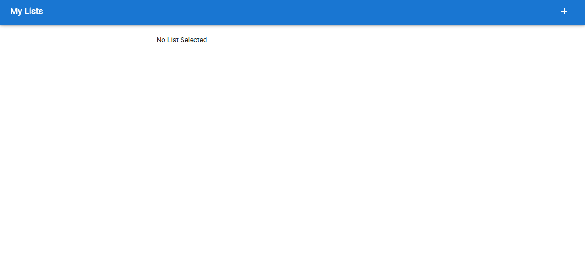
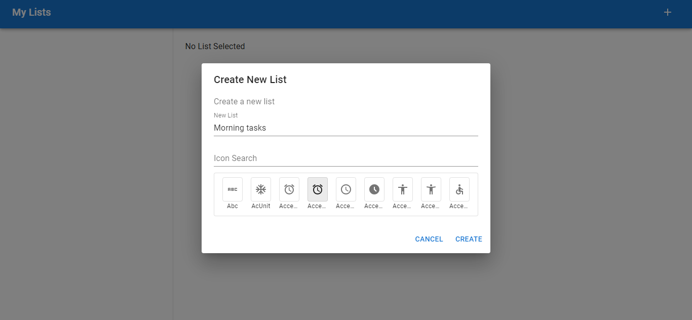
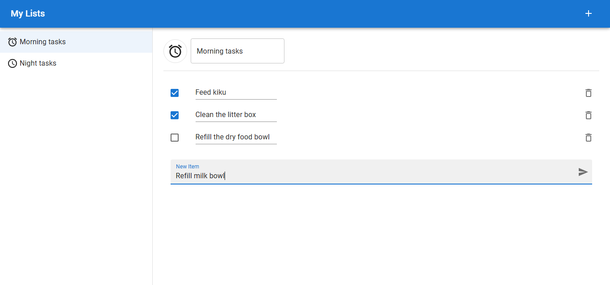

<div id="top"></div>


[](https://mui.com/material-ui/)


<!-- PROJECT LOGO  -->
<br />
<div align="center">

<h1>ToDone</h1>

  <p align="center">
    <a href="https://to-done-mu.vercel.app/">View Demo</a>
    ·
    <a href="https://github.com/SalahShallapy/ToDone/issues">Report Bug</a>
  </p>
</div>

A React Todo App built with Vite and Material-UI for a sleek design and user-friendly interface. Add, edit, and delete tasks effortlessly with this responsive application. Deployed on Vercel for a fast and seamless experience.

## Project Overview

### Overview



### Newlist Overview



### List's Tasks Overview



## Features

- **Add Tasks:** Easily create new tasks with a clear input form.
- **Mark as Complete:** Mark tasks as done with a single click.
- **Delete Tasks:** Remove unwanted tasks effortlessly.
- **Responsive Design:** Optimized for desktop and mobile devices.
- **MUI Styling:** Leverages Material-UI for a modern and visually appealing interface.
- **Dynamic List Updates:** Instantly updates the task list for a seamless experience.

## Usage

1. **View Tasks:**

   - Open the app to see your current list of tasks.

2. **Add a Task:**

   - Enter the task name in the input field and press the "Add" button.

3. **Mark as Complete:**

   - Click the checkbox next to a task to mark it as done.

4. **Delete a Task:**

   - Use the delete icon to remove a task from the list.

5. **Responsive Behavior:**
   - Access the app on any device for a consistent experience.

## Project Structure

```
ToDone
│      .eslintrc.cjs
│      .gitignore
│      ..prettierrc.json
│      index.html
│      package-lock.json
│      package.json
│      README.md
│      vite.config.js
│
│
└─── src
│   │    main.jsx
│   │    util.js
│   │
│   └─── components
│   │      AllTodoLists.jsx
│   │      App.jsx
│   │      AppHeader.jsx
│   │      CurrentTodoList.jsx
│   │      NewListDialog.jsx
│   │
│   └─── hooks
│   │     useTodoList.js
│   │     useTodoLists.js
│   │
│   └─── providers
│   │     AppState.jsx
│   │
│   └─── assets -------> All images
│
```

## Installation

To get started with the project locally:

1. Clone the repository:
   ```bash
   git clone https://github.com/SalahShallapy/ToDone
   ```
2. Navigate to the project directory:
   ```bash
   cd ToDone
   ```
3. Install dependencies:
   ```bash
   npm install
   ```
4. Run the project:
   ```bash
   npm run dev
   ```

## Contributing

Contributions are what make the open source community such an amazing place to learn, inspire, and create. Any contributions you make are **greatly appreciated**.

If you have a suggestion that would make this better, please fork the repo and create a pull request. You can also simply open an issue with the tag "enhancement".
Don't forget to give the project a star! Thanks!

1. Fork the Project
2. Create your Feature Branch (`git checkout -b feature/AmazingFeature`)
3. Commit your Changes (`git commit -m 'Add some AmazingFeature'`)
4. Push to the Branch (`git push origin feature/AmazingFeature`)
5. Open a Pull Request

<p align="right">(<a href="#top">back to top</a>)</p>
